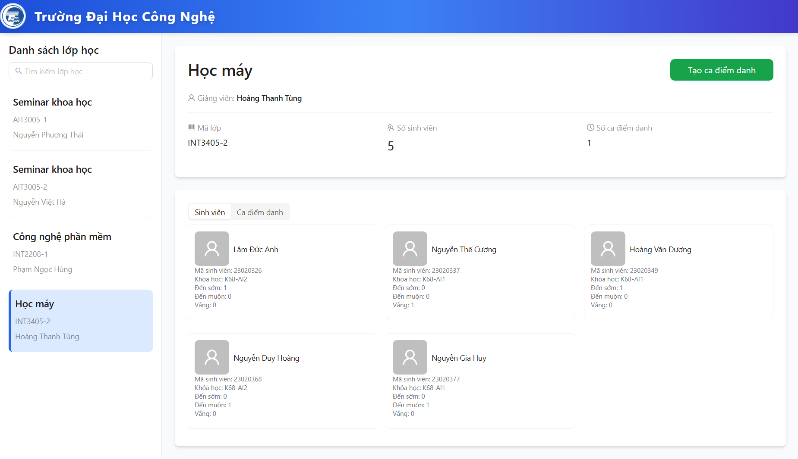
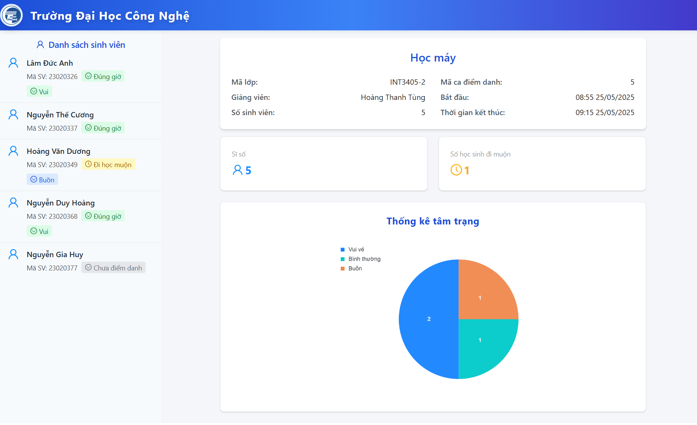
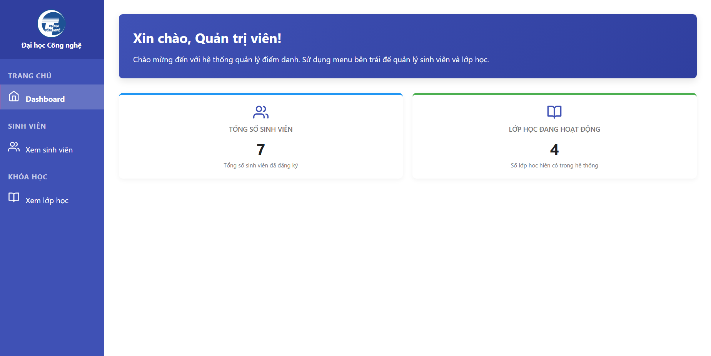
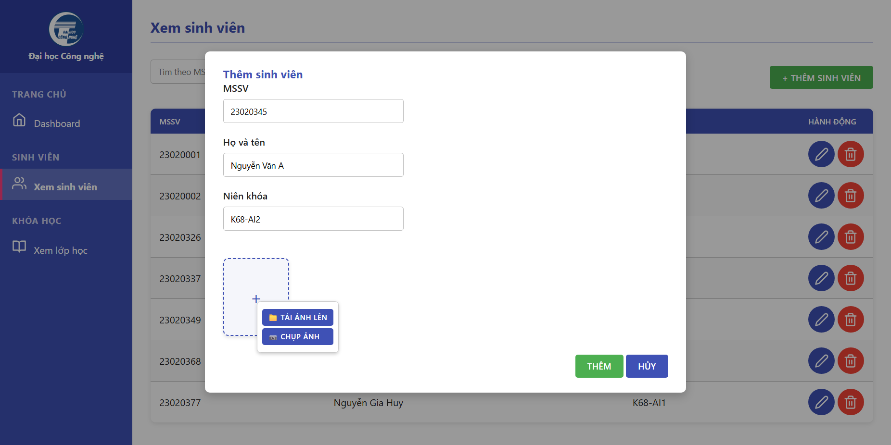
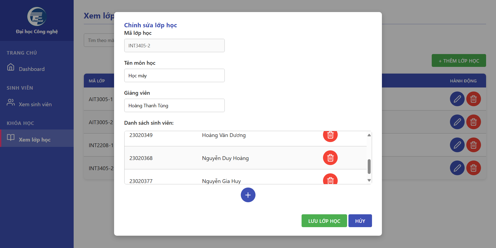

# UET Attendance System: Hệ thống điểm danh và nhận diện cảm xúc sinh viên
<p align="center">
  
</p>

UET Attendance System - Hệ thống điểm danh và nhận diện cảm xúc sinh viên, được thiết kế để hỗ trợ việc quản lý điểm danh cho Trường Đại học Công Nghệ. Hệ thống tích công nghệ nhận diện khuôn mặt giúp tự động hóa quá trình điểm danh của sinh viên, đồng thời phân tích cảm xúc sinh viên trong lúc điểm danh để giảng viên có thể nắm bắt và điều chỉnh bài học của mình ngày hôm đó.


# Chạy dự án bằng Docker

Nếu đã cài sẵn Docker trên máy tính của mình, bạn có thể thực hiện theo các bước dưới đây để cài dặt và chạy hệ thống:

Bước 1: Khởi động Docker Desktop

Bước 2: Tải xuống file `docker-compose.yml` tại repo này vào sao chép vào một thư mục bất kì. Tuy nhiên, mọi thứ sẽ hoạt động tốt nếu thư mục đó không chứa bất kì file hay thư mục nào khác.

Bước 3: Mở thư mục của bạn trong terminal và chạy câu lệnh sau:

```bash
   docker-compose up
```

Bạn sẽ cần chờ một lúc để hệ thống khởi chạy.

Bước 4: Khi khởi động hoàn tất, bạn đã có thể sử dụng ứng dụng.

1. Mở http://localhost:3000/ để vào giao diện điểm danh
2. Mở http://localhost:8081/ để vào giao diện admin

# Các chức năng chính của hệ thống

- Nhận diện và phân tích cảm xúc sinh viên
- Thêm/xóa sinh viên, tạo lớp học.
- Dễ dàng truy xuất thông tin sinh viên từ cơ sở dữ liệu.
- Tạo ca điểm danh, setup thời gian linh hoạt.


## Chức năng cho người dùng

<center>


Khi mở ứng dụng, giảng viên sẽ tìm và lựa chọn lớp học của mình để tạo ca điểm danh

</center>

<center>


Mỗi sinh viên lần lượt đưa khuôn mặt vào trong camera, hệ thống sẽ tự nhận diện sinh viên theo thời gian thực và thực hiện tự động điểm danh cho sinh viên đó.

</center>

<center>


Kết thúc mỗi ca điểm danh sẽ là bảng thông kê, hiển thị các chi tiết những sinh viên nào đi học đúng giờ, đi học muộn, vắng kèm theo tâm trạng.

</center>


## Chức năng cho admin

<center>


Giao diện quản trị viên sử dụng để quản lý cơ sở dữ liệu phục vụ cho điểm danh, bao gồm thêm xóa sửa sinh viên và lớp học.
</center>

<center>


Quản trị viên có thể thêm, xóa, hoặc sửa sinh viên trong cơ sở dữ liệu. Ở phần này, các bức ảnh do sinh viên cung cấp hoặc chụp sẽ được lấy làm dữ liệu đối chiếu điểm danh.
</center>

<center>


Quản trị viên có thể thêm, sửa, xóa các lớp học, thêm hoặc xóa sinh viên ra khỏi một lớp học nào đó.
</center>


# Cấu trúc hệ thống

| Thành phần                    | Công nghệ/thư viện        |
|-------------------------------|---------------------------|
| Backend                       | Python, FastAPI           |
| AI Backend                    | DeepFace                  |
| Cơ sở dữ liệu                 | MySQL                     |
| Giao diện điểm danh           | ReactJS                   |
| Giao diện quản trị            | HTML-CSS-JS               |


# Đội ngũ phát triển

| Họ tên             | Mã sinh viên | Vai trò                             |
|--------------------|--------------|-------------------------------------|
| Lâm Đức Anh        |     23020326 | Quản lý dự án                       |
| Nguyễn Gia Huy     |     23020377 | Phát triển mô đun AI                |
| Hoàng Văn Dương    |     23020349 | Phát triển giao diện cho người dùng |
| Nguyễn Thế Cương   |     23020337 | Phát triển giao diện cho admin      |
| Nguyễn Duy Hoàng   |     23020368 | Xây dựng database, viết báo cáo     |


