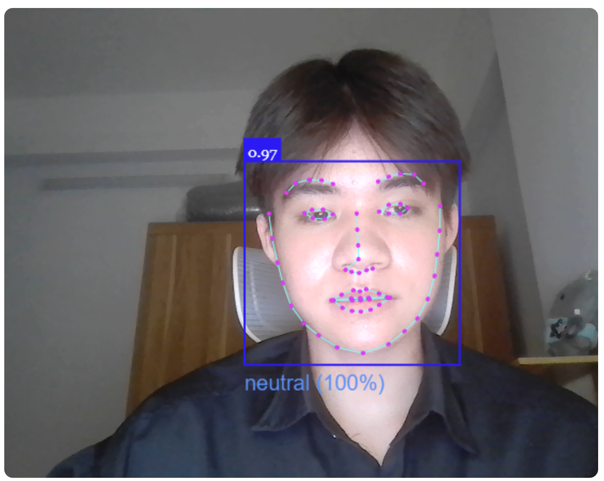

# Hệ thống điểm danh và nhận diện cảm xúc sinh viên

<p align="center">
  
</p>

Hệ thống điểm danh và nhận diện cảm xúc sinh viên được xây dựng dựa trên deepface với nhiều tính năng tiên tiến như nhận dạng và phân tích cảm xúc từ hình ảnh. Với hệ thống tiên tiến này giảng viên có thể dễ dàng quản lý lớp học, tình trạng tham gia môn học của sinh viên từ đó đưa ra những điều chỉnh hợp lý.

## Người đóng góp 
- Lâm Đức Anh - Xây dựng backend
- Nguyễn Gia Huy - Xử lý modelAI
- Nguyễn Duy Hoàng - Xây dựng database
- Hoàng Đăng Dương - Thiết kế giao diện frontend-user
- Nguyễn Thế Cương - thiết kế giao diện frontend-admin

# Cài đặt

1. **Cài đặt Docker Desktop**  
   Tải và cài đặt Docker Desktop từ [https://www.docker.com/products/docker-desktop/](https://www.docker.com/products/docker-desktop/)

2. **Tải xuống folder lưu trữ của chúng tôi**  

3. **Giải nén tập tin đã tải xuống**

4. **Mở Docker Desktop**

5. **Mở Command Prompt**  
   Nhấn `Windows + S`, gõ `cmd`, và nhấn Enter.

6. **Di chuyển đến thư mục chứa dự án**  
   Dùng lệnh cd + đường dẫn đến file chứa dự án

7. **Chạy lệnh** 
```bash
   docker-compose up -d
```
8. **Truy cập và hệ thống**
Mở trình duyệt truy cập http://localhost:8000/

# Minh họa ứng dụng

1. phát hiện và nhận dạng khuôn mặt trong thời gian thực (quay vd đã.... )

<p align="center">
  
</p>

2. điếm danh và nhận diện cảm xúc chính xác

<p align="center">
  
</p>

# Thông tin liên quan

## 


