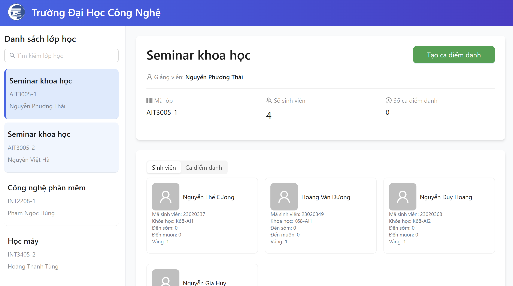
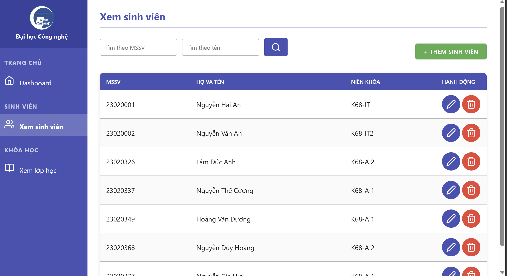
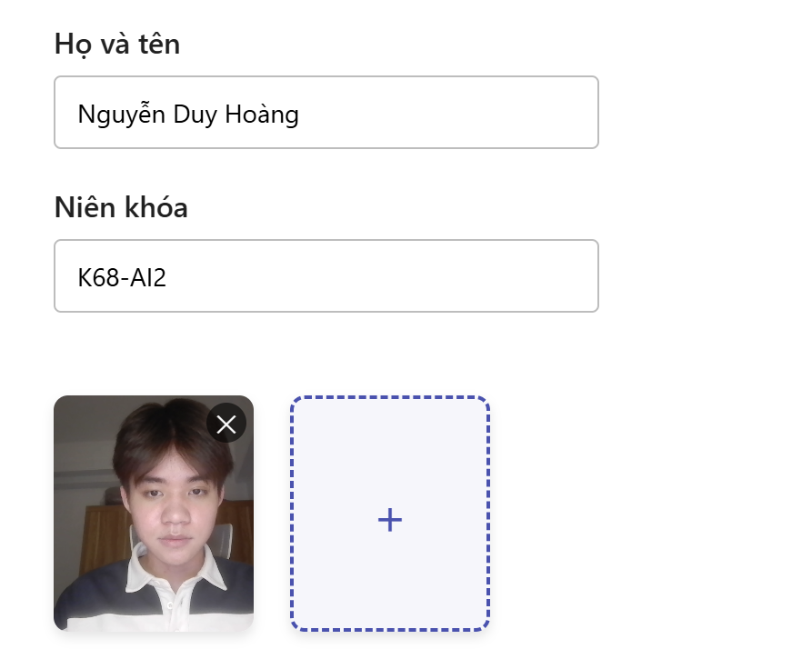
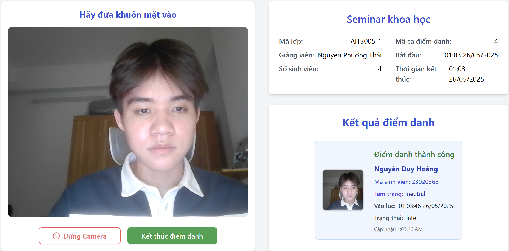

# UET Attendance System: Hệ thống điểm danh và nhận diện cảm xúc sinh viên
<p align="center">
  
</p>

Hệ thống điểm danh và nhận diện cảm xúc sinh viên được xây dựng dựa trên deepface với nhiều tính năng như nhận dạng và phân tích cảm xúc từ hình ảnh. Với hệ thống này giảng viên có thể dễ dàng theo dõi lớp học, tình trạng tham gia môn học của sinh viên từ đó đưa ra những điều chỉnh hợp lý.


# Chạy dự án bằng Docker

Bước 1: khởi động Docker Desktop 

Bước 2: Mở terminal và chạy lần lượt các câu lệnh sau

```shell 
   $ docker pull lamducanh/uetas2-database
   $ docker pull lamducanh/uetas2-backend
   $ docker pull lamducanh/uetas2-frontend
   $ docker pull lamducanh/uetas2-frontend-admin
```

Bước 3: Copy file `docker-compose.yml` tại repo này vào một thư mục bất kì. Hãy đảm bảo rằng thư mục của bạn không có bất kì file nào khác.

Bước 4: Khởi động hệ thống bằng lệnh

```bash
   $ docker-compose up
```

Bước 5: Sử dụng hệ thống 

1. Mở http://localhost:3000/ để vào giao diện điểm danh
2. Mở http://localhost:8081/ để vào giao diện admin

# Các chức năng chính của hệ thống

- Nhận diện và phân tích cảm xúc sinh viên
- Thêm/xóa sinh viên, tạo lớp học.
- Dễ dàng truy xuất thông tin sinh viên từ cơ sở dữ liệu.
- Tạo ca điểm danh, setup thời gian linh hoạt.


## Minh họa ứng dụng

1. Giao diện gần gũi, thao tác đơn giản dễ sử dụng.

<p align="center">
  
  
</p>

2. Phát hiện và nhận dạng khuôn mặt trong thời gian thực

<p align="center">
  
</p>

2. Điểm danh và nhận diện cảm xúc chính xác

<p align="center">
  
  
</p>


# Cấu trúc hệ thống

| Thành phần                    | Công nghệ sử dụng         |
|-------------------------------|---------------------------|
| Backend API                  | Python                     |
| AI Model xử lý khuôn mặt     | DeepFace / face_recognition|
| Cơ sở dữ liệu                | MySQL                      |
| Giao diện người dùng (User)  | ReactJS                    |
| Giao diện quản trị (Admin)   | HTML-CSS                   |


# Đội ngũ phát triển

| Họ tên             | Mã sinh viên | Vai trò                             |
|--------------------|--------------|-------------------------------------|
| Lâm Đức Anh        |     23020326 | Xây dựng backend                    |
| Nguyễn Gia Huy     |     23020377 | Xử lý model AI                      |
| Nguyễn Duy Hoàng   |     23020368 | Xây dựng database                   |
| Hoàng Văn Dương    |     23020349 | Thiết kế giao diện frontend - user  |
| Nguyễn Thế Cương   |     23020337 | Thiết kế giao diện frontend - admin |


